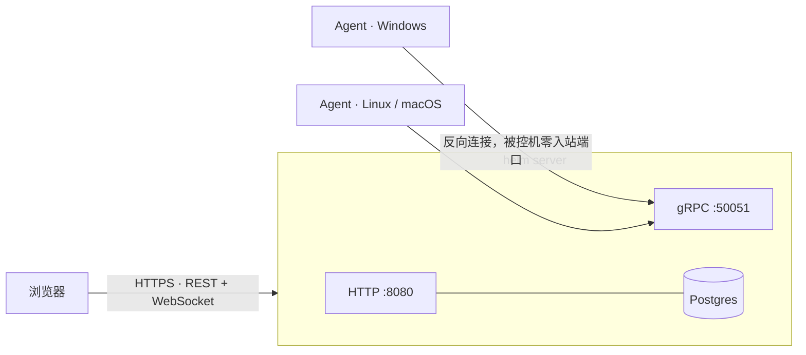

# helm — 自建运维中控台

<p align="center">
  <a href="https://github.com/trtyr/helm/actions/workflows/ci.yml"></a>
  <a href="LICENSE"></a>
  
</p>

把 Agent 装到你的机器上，然后浏览器打开控制台：**跑命令、开终端、传文件、管服务**，出事的时候还能对 Windows 主机做应急响应取证。开源、自托管，数据全程在你自己的服务器上——不装客户端全家桶，不把 root shell 交给第三方。

<!-- TODO(截图): hero —— 控制台主机总览页 -->

## 这是你想要的吗

如果你管着几台云主机、几台家里/公司的设备，日常就是这几件事：

- **想跑条命令**——开 SSH、敲命令、翻滚动，一台还好，五台就开始烦
- **想看它还活着吗**——CPU 高不高、磁盘满没满、是不是悄悄掉线了
- **想传个文件**——scp 拼参数，或者开个临时 HTTP 服务
- **出过事**——中过挖矿、起过可疑进程，事后想查：它从哪来的、还动了什么、怎么进去的

helm 把这些收进一块面板。装好之后是这样的：

<!-- TODO(截图): 主机列表 + 终端 + IR 三联图 -->

## 功能

**远程执行** — 任意主机上下发命令，输出实时回传；批量下发、定时任务（Server 重启后自动恢复）、中途取消、超时兜底。

**Web 终端** — 浏览器直接开 shell（PTY），跟坐在机器前一样，穿 CDN 也不掉。

**文件传输** — 上传 / 下载 / 列目录，SHA-256 校验，传输记录可查。

**服务与进程** — 系统服务 start / stop / restart（Windows Service、systemd、launchctl）；进程列表与进程树，办公软件派生解释器这类异常父子关系自动高亮。

**监控与告警** — CPU / 内存 / 磁盘采集；心跳掉线检测，持续离线自动升级为告警；站内通知中心。

**应急响应（Windows）** — 自启动项全景（12 分类 1300+ 条，签名校验）、基线快照对比、流式内存扫描、USN 文件时间线、安全日志、一键证据包。取证是只读的，不在被控机上做变更。

**AI 就绪** — 内置 MCP 接口（41 个工具，scope 授权），Claude Desktop 等 LLM 客户端可以直接安全地查状态、跑命令——AI 操作员和你走同一套权限与审计。

**审计** — 登录、执行、文件、IR，每个动作都留痕，按关键词可搜。

## 5 分钟部署

只需要一台有 Docker 的机器：

```bash
git clone https://github.com/trtyr/helm && cd helm

# ① 配置：改 3 个密钥（都用 openssl rand -hex 32 生成）
cd deploy/prod && cp env.example .env && vi .env

# ② 构建控制台静态资源（一次性）
pnpm --dir ../.. install --frozen-lockfile && pnpm --dir ../.. build

# ③ 起
docker compose up -d --build
docker compose ps          # 三个服务都 healthy

# ④ 打开
open https://localhost     # 本地预演；上云则换成你 .env 里配的域名
```

首次启动按 `.env` 里的 `HELM_BOOTSTRAP_ADMIN_USER / PASSWORD` 创建管理员——不设就是出厂值 `admin / admin123`，且默认开启的强凭据守卫会**拒绝用出厂口令启动**，不存在「门开着」的默认态。

然后在控制台「生成 Agent」页点一下：Server 现场交叉编译，把连入地址和注册 token 烙进二进制，下载扔到目标机上运行即可上线（Windows / Linux / macOS）。

> 手动安装、systemd / Windows 服务方式、mTLS 配置，见 **[部署手册](deploy/README.md)**。

## 架构



Agent 主动反向连到 Server，一条 gRPC 双向流复用执行、文件、服务、IR 全部子任务——被控机不开端口，NAT 后面照管不误。（同区域内网也可以反向操作：forward 模式让 Agent 监听、Server 拨号。）

## 安全

自托管的安全产品，先说安全：

- Agent 认证：注册 token 换 mTLS 证书，私钥 0600；证书只由服务端签发，拿 token 签不出 CA
- 凭据：恒定时间比较、token 多值轮换、改密码后旧会话立即失效、登录失败按账号 + IP 双维度退避
- 审计：全操作落库可搜
- 边界：这是自用级安全模型，不是合规产品；公网部署请过一遍[部署手册](deploy/README.md)的安全清单

## 已知限制

- 应急响应（IR）仅 Windows；Linux / macOS 有执行、文件、终端、监控，无 IR
- 单机部署，无高可用——一台服务器 + 一个 Postgres，备份脚本在 `deploy/prod/backup.sh`
- 文档以中文为主

## 用什么写的

Rust（Server + Agent，约 2.9 万行）+ TypeScript（控制台，React + xterm.js，约 1.7 万行）+ protobuf。对实现细节感兴趣？[本地开发指南](docs/development.md)、[配置参考](docs/configuration.md)、[API 契约](docs/openapi.yaml)。

## License

[MIT](LICENSE)
