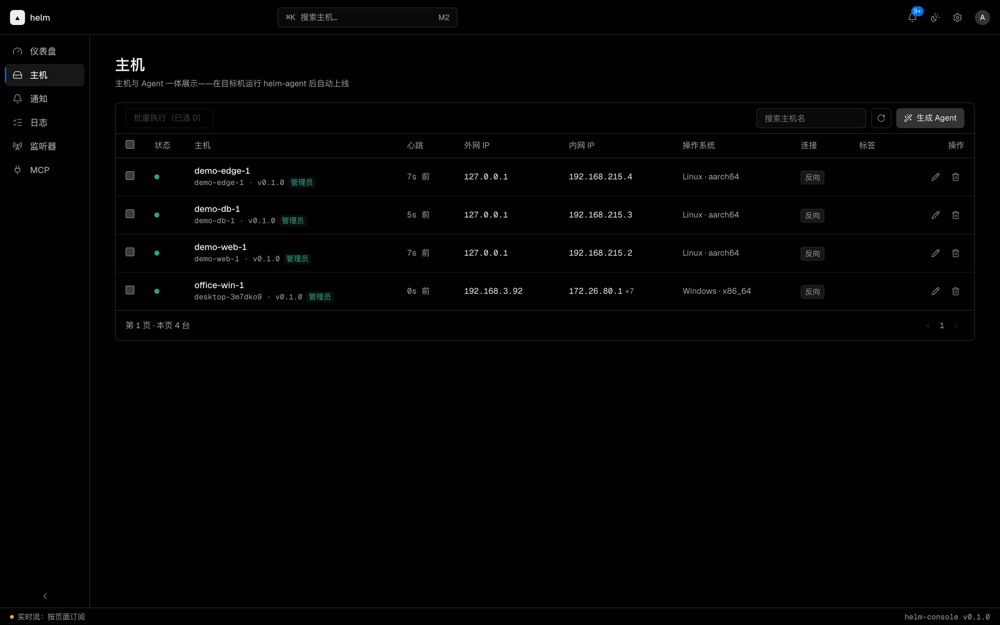
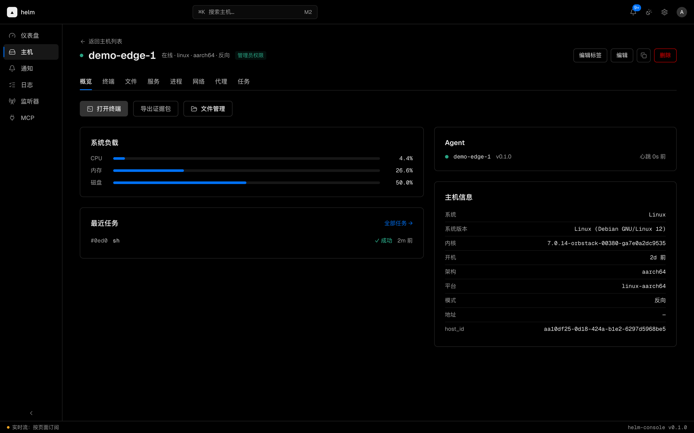
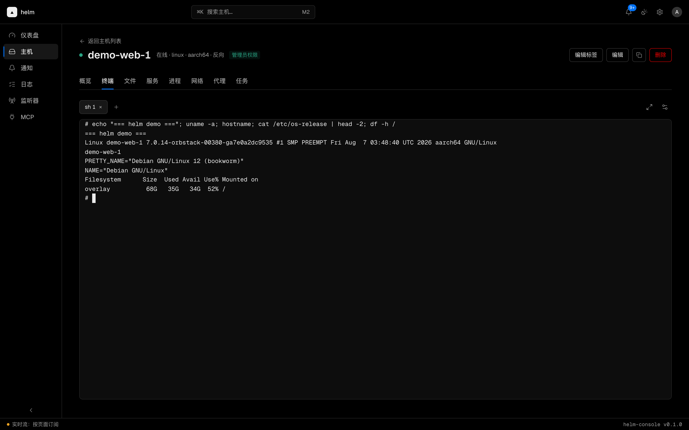
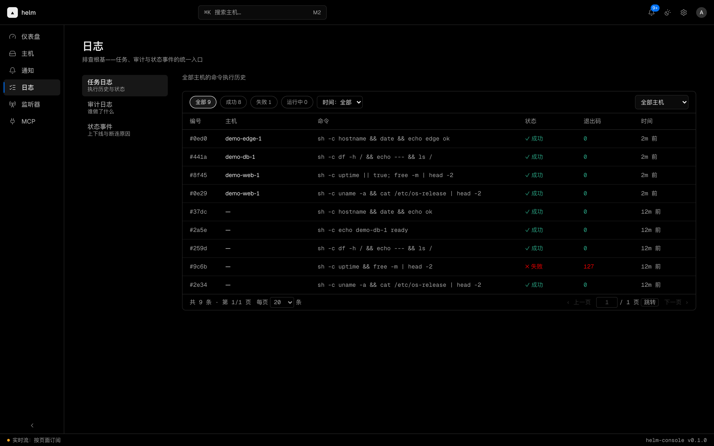

<div align="center">

# helm

**把散落的机器收进一块面板 —— 自建运维中控台**

[](https://github.com/trtyr/helm/actions/workflows/ci.yml)
[](LICENSE)


[功能](#它能做什么) • [快速部署](#怎么装) • [接入机器](#把你的机器接进来) • [给开发者](#给开发者)



</div>

把 Agent 装到你的电脑和服务器上，然后打开浏览器：**跑命令、开终端、传文件、重启服务**，哪台机器掉线了马上知道，出安全事件的时候还能给 Windows 机器做一遍"全身体检"。

helm 装在你自己的机器上，数据全程不经过任何第三方。

## helm 是什么

一句话：**一个装在自己服务器上的运维控制台。**

你肯定遇到过这些事——

- 手里三五台机器，今天这台磁盘满了，明天那台服务挂了，全靠碰运气发现
- 想在服务器上跑个命令，得开 SSH、敲命令、翻屏找结果，机器一多就乱
- 想传个文件上去，scp 参数拼半天
- 电脑出了可疑进程，想知道它从哪来、还干了什么，手头却没有证据

helm 就是把这一整套搬进浏览器：**每台机器装一个小小的 Agent，剩下的都在网页里完成**。Agent 主动连向你的服务器，被控的机器不需要开放任何端口；数据也全部存在你自己的服务器上，不经过任何第三方。

## 它能做什么

**网页终端** — 浏览器里直接敲命令，跟坐在那台机器前一模一样。

**远程执行** — 给一台或者全部机器下发命令，输出实时回传；还能设定时任务，比如每天凌晨自动清理日志。

**文件传输** — 上传、下载、列目录，带完整性校验，传输记录可查。

**服务管理** — 系统服务一键启停重启（Windows 服务、systemd、launchctl 都支持）。

**监控告警** — CPU、内存、磁盘一目了然；机器掉线自动通知你，持续离线还会升级提醒。

**应急响应（Windows）** — 出安全事件时的"全身体检"：开机自启动项全景、可疑进程树、内存扫描、文件操作时间线、安全日志，一键打包证据带走。

**操作留痕** — 谁在哪台机器上做了什么，每一步都有记录，随时翻旧账。

**接入 AI 助手** — 支持 Claude 这类 AI 客户端通过标准接口安全地帮你查状态、跑命令，AI 和你用的是同一套权限和记录。

<p align="center">
  
  
  
</p>

## 怎么装

只需要一台装了 Docker 的电脑（云服务器、家里的 NAS、甚至你自己的电脑都行）：

```bash
git clone https://github.com/trtyr/helm && cd helm

# ① 生成配置
cd deploy/prod && cp env.example .env

# ② 改 3 个密钥（.env 里有说明，各一行）
vi .env

# ③ 构建
pnpm --dir ../.. install --frozen-lockfile
pnpm --dir ../.. build

# ④ 启动
docker compose up -d --build
```

然后浏览器打开 `https://localhost`（或你配置的域名），用 `.env` 里设置的管理员账号登录，就看到上面那张图了。

> 首次使用建议先在本机跑一遍再上云。详细的参数说明、域名与 HTTPS 配置、安全清单，见 **[部署手册](deploy/README.md)**。

## 把你的机器接进来

在控制台里点「**生成 Agent**」，选好目标系统，helm 会现场编译出一个安装包——把它拷到你想管理的机器上运行，几秒后它就出现在主机列表里了。不需要开放端口，不需要配置网络，Agent 会自己找到家。

## 它现在不能做什么

说实话比装什么都列上更有用：

- 「应急响应」目前只支持 Windows；Linux 和 macOS 机器有执行、终端、文件、监控，没有体检功能
- 一台服务器带所有机器，暂不支持多台服务器组网（对个人和小团队，这恰恰意味着简单）
- 界面和文档目前以中文为主

## 给开发者

helm 用 Rust 和 TypeScript 写成，约 4.6 万行代码，测试 220 余条，CI 覆盖 Linux / Windows / 前端三平台。

- [本地开发指南](docs/development.md)
- [架构与安全设计](docs/architecture.md)
- [配置参考](docs/configuration.md)
- [API 契约（OpenAPI）](docs/openapi.yaml)

---

<div align="center">

**你的机器，你的面板，你的数据。**

[部署手册](deploy/README.md) • [配置参考](docs/configuration.md) • [报告问题](https://github.com/trtyr/helm/issues)

</div>

## License

[MIT](LICENSE)
