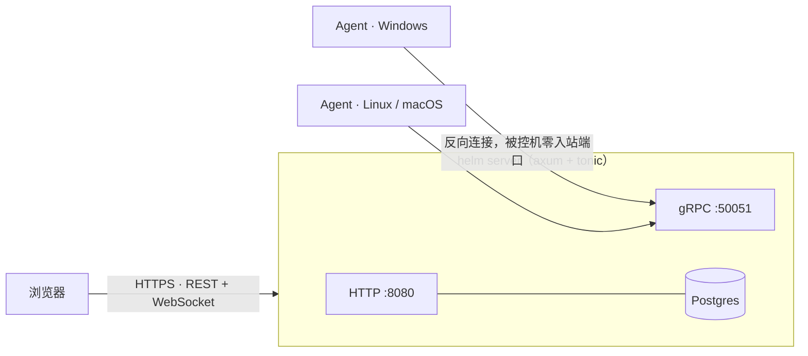

# helm 的架构与安全设计

> 这篇写给想了解实现细节的开发者。如果你只想使用 helm，看 [README](../README.md) 和[部署手册](../deploy/README.md)就够了。

## 架构一览

- **反向连接（默认）**：Agent 主动连 Server，被控机零入站端口，NAT/防火墙后面照管不误。**正向模式**可选：Agent 监听、Server 拨号，适配同区域内网——两种模式复用同一套 gRPC 信令。
- **一条 gRPC 双向流承载一切**：执行、文件、服务、IR 全部子任务靠业务 id 在同一条流上多路复用，不为每种能力开一条连接。
- **终端走 WebSocket**：浏览器 xterm.js → server → Agent PTY，两端无插件。
- **Windows 原生采集**：Agent 的 Windows 监控数据不依赖外部命令——服务走 SCM、网络走 IpHelper API、磁盘走 GetLogicalDrives、进程路径走 QueryFullProcessImageName，无编码问题。
- **MCP 接口**：41 个 op 全部编目（scope / os / 参数），LLM 客户端经 JSON-RPC 与人在同一套权限与审计里操作。

## 安全模型

不吹「企业级」，说实际做了什么：

- **Agent 认证**：注册 token 换 mTLS 证书，私钥 0600。server 只取 CSR 里的公钥，其余属性（CA 位、密钥用途、有效期）全部服务端重建——拿共享 token 签不出 CA 证书；CSR 的 CN 必须等于 agent_id，缺 CN 与不匹配都拒绝并记审计。
- **凭据卫生**：恒定时间比较、token 多值轮换、JWT 改密即吊销（每请求核对 token_version）、登录失败按账号 + IP 双维度退避（429）。
- **默认安全**：出厂口令遇 `HELM_REQUIRE_STRONG_DEFAULTS=true` 直接拒绝启动；弱默认启动打 ERROR。没有「门开着」的默认态。
- **全量审计**：认证、执行、文件、IR 全操作落 `audit_logs`，关键词可搜。

**边界**：这是自用级安全模型，不是合规产品（无等保 / SOC2 之类认证）。暴露公网前请过一遍[部署手册](../deploy/README.md)的上线前安全清单。

## 关键设计取舍

- **IR 只读**：应急响应采集是纯取证口径，只读、可打包、落证据，不在被控机上做变更（自启动项的禁用/启用/删除除外，那是显式动作）。
- **保留策略**：metrics / alerts / notifications / jobs / audit_logs 等按 `HELM_RETENTION_DAYS`（默认 90 天）自动清理；IR 快照按条数、页面缓存按 TTL 独立清理——没有无限增长的表。
- **重启语义**：优雅停机（SIGTERM 排空 + 15s 兜底）；重启后启动即对账，把上一进程遗留的半完成任务置为 failed 并写明原因，不造假超时。
- **有意不做**：多租户、插件市场、指标长期存储、高可用。单机 + Postgres + 备份脚本，够用。
